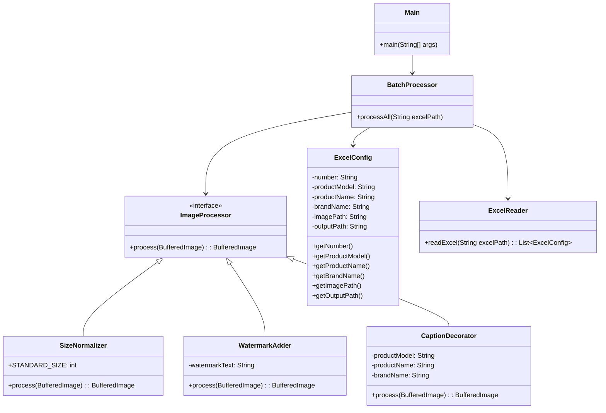

# 画像バッチ処理デモプロジェクト (Image Processor Demo)

このプロジェクトは、Javaを使用して開発したバッチ型画像処理ツールです。  
就職活動において、コーディングスキル・モジュール設計力・システム統合力を示すためのデモンストレーション目的で作成しました。

## プロジェクト概要
- Excel設定ファイルから画像情報を読み込み
- 画像サイズを統一（中央トリミングまたは白背景補完による800x800ピクセル標準化）
- 斜め方向に透かし文字（ウォーターマーク）を追加
- 製品モデル名・製品名・ブランド名のキャプションを追加
- 複数画像を一括で自動処理

## 主な機能
- **Excel駆動設定** (型番、製品名、ブランド名など)
- **標準サイズ統一** (自動トリミングまたはパディング)
- **透かし文字追加** (一定間隔で斜め配置)
- **キャプション挿入** (上部・下部に製品情報を表示)

## 使用方法
1. 元画像を `data/input/` フォルダに保存
2. `worksheet.xlsx` というExcelファイルを作成し、以下のカラムを設定
   | カラム名 | 説明 |
   |:--------|:-----|
   | Number | 入力画像ファイル名（拡張子なし） |
   | Product Model | 表示する製品モデル名 |
   | Product Name | 表示する製品名 |
   | Brand Name | 右下角に表示するブランド名 |
3. 以下のコマンドを実行
   ```bash
   mvn clean package
   java -jar target/image-processor-1.0-SNAPSHOT-jar-with-dependencies.jar

   ```

## システム構成図 (UML Diagram)


# Image Processor Demo

This project is a Java-based batch image processing tool designed for demonstration purposes in job applications.

## Project Overview
- Reads image processing configurations from an Excel file.
- Standardizes image sizes (center crop or white padding to 800x800px).
- Adds diagonal watermark text.
- Adds product model and brand captions.
- Batch processes multiple images automatically.

## Features
- **Excel-driven configuration** (model name, product name, brand name, etc.)
- **Automatic image resizing** based on standard size.
- **Watermarking** with adjustable interval and opacity.
- **Caption decoration** for product information.

## How to Use
1. Place original images into `data/input/`.
2. Prepare an Excel file (`worksheet.xlsx`) with the following columns:
   | Column | Description |
   |:------|:------------|
   | Number | Image file name (without extension) |
   | Product Model | Product model to display |
   | Product Name | Product name to display |
   | Brand Name | Brand caption for bottom-right |
3. Execute the following command:
   ```bash
   mvn clean package
   java -jar target/image-processor-1.0-SNAPSHOT-jar-with-dependencies.jar
   ```
